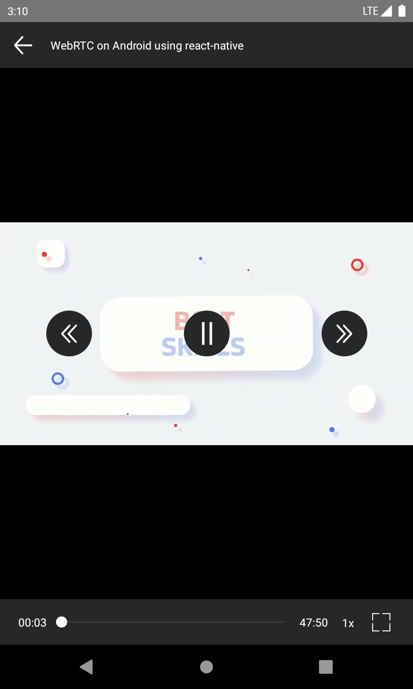
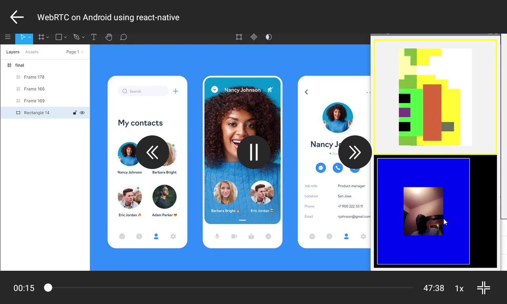
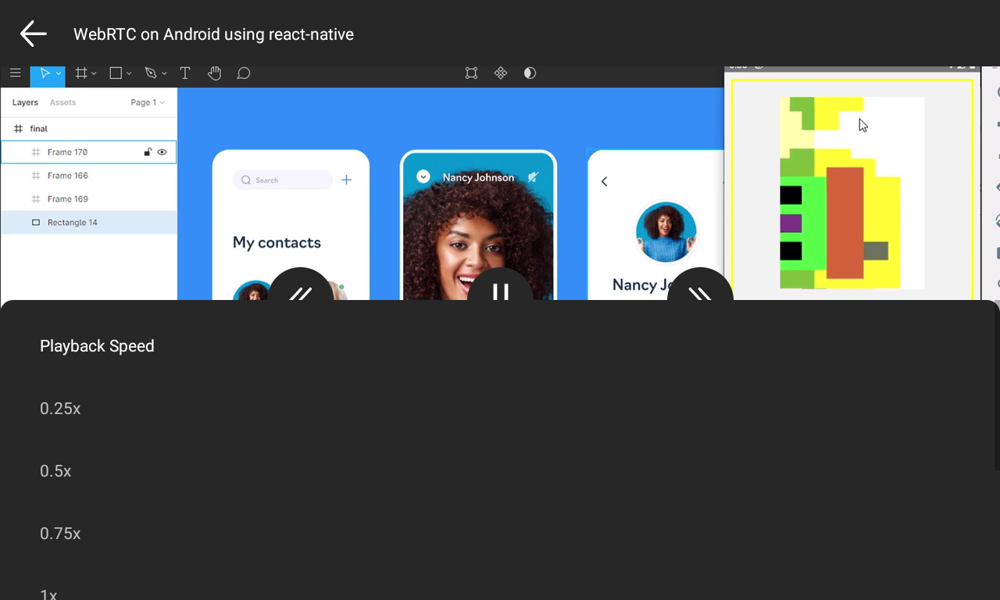

# react-native-video-ui-controls

A simple video controls build on top of react-native-video

# Demo

1 | 2 | 3
--|--|--
 | | 

# Usage

```js
import React from 'react';
import {Platform, View} from 'react-native';
import Video from './src';

const component = (props: any) => {
    const {name, source} = props.route.params;

    const video = (
        <Video
            name={name}
            source={source}
            onBackPress={() => {
                props.navigation.goBack();
            }}
            isFullscreen={Platform.OS === 'ios'}
        />
    );

    return <View style={{flex: 1}}>{video}</View>;
};

export default component;

```
